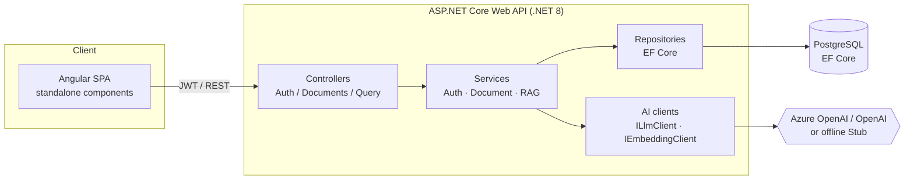

# DocIntel — AI Document Intelligence SaaS

**▶ Live demo:** https://victorious-smoke-03453aa0f.7.azurestaticapps.net
&nbsp;·&nbsp; API health: https://docintel-dev-api.whitemoss-6d3610e2.eastus2.azurecontainerapps.io/health

> Running on Azure: Angular UI on **Static Web Apps**, the .NET API on **Container Apps**,
> data in **PostgreSQL Flexible Server**, answers from **OpenAI**. Register a workspace,
> upload a PDF/`.docx`/text file, and ask questions with cited sources.

DocIntel is a multi-tenant SaaS where teams upload documents and ask
natural-language questions answered with **retrieval-augmented generation
(RAG)** over their own content. It is built on the Microsoft stack — an
**ASP.NET Core (C# / .NET 8)** API with a clean layered architecture, **Entity
Framework Core**, and an **Angular** front end — and ships with Docker,
Terraform for Azure, and CI/CD.

The AI layer is **interface-based**: it runs fully offline with a deterministic
stub embedding + LLM client (no API keys needed for dev or tests), and swaps to
**Azure OpenAI** or **OpenAI** via configuration alone.

---

## Architecture



### Request flow

- **Ingestion:** `POST /api/documents` → `DocumentService` splits text into
  overlapping chunks → `IEmbeddingClient` embeds each chunk → vectors persisted
  via EF Core, scoped to the caller's workspace (tenant).
- **Query:** `POST /api/query` → embed the question → rank workspace chunks by
  cosine similarity → take top-K → `ILlmClient` answers grounded in that context
  and returns cited sources.
- **Isolation:** every request carries a workspace id in its JWT; all data
  access is filtered by that id, so a tenant can never read another's documents.

---

## Tech stack

| Layer            | Technology |
|------------------|------------|
| Backend          | ASP.NET Core Web API, C#, .NET 8 (Controllers → Services → Repositories) |
| Validation       | DTOs + FluentValidation |
| Data             | Entity Framework Core, PostgreSQL (Azure Database for PostgreSQL in cloud) |
| Ingestion        | Text extraction from PDF (PdfPig) and Word `.docx` (Open XML SDK); plain text/markdown pass-through |
| AI / RAG         | Embeddings + cosine vector search, `ILlmClient` / `IEmbeddingClient` abstractions (Stub · Azure OpenAI · OpenAI) |
| Auth             | JWT bearer tokens, BCrypt password hashing, multi-tenant workspaces |
| Frontend         | Angular (standalone components, signals, HttpClient + auth interceptor) |
| Tests            | xUnit + Moq (service layer), offline stub clients |
| Containerization | Dockerfiles (API + web), docker-compose (api + db + web) |
| IaC              | Terraform — Azure Container Apps, Azure Database for PostgreSQL, Azure Container Registry |
| CI/CD            | GitHub Actions (build, test, docker build/push) |

---

## Features

- Multi-tenant workspaces with JWT auth (register provisions a workspace + admin).
- Document ingestion with chunking and embedding — PDF, Word (`.docx`), and plain
  text/markdown files are parsed to text on upload (pasted text also supported).
- RAG question-answering with ranked, cited source passages.
- Pluggable AI provider (offline stub by default; Azure OpenAI / OpenAI ready).
- Swappable persistence: in-memory for instant local dev, PostgreSQL for real use.
- Swagger UI in development, health endpoint for probes.
- Angular UI: auth screen, document upload (file or pasted text), and a chat panel.

---

## Project layout

```
ai-doc-intelligence/
├── DocIntel.sln
├── docker-compose.yml
├── backend/
│   ├── Dockerfile
│   ├── src/DocIntel.Api/
│   │   ├── Controllers/        # Health, Auth, Documents, Query
│   │   ├── Services/           # AuthService, DocumentService, RagService
│   │   ├── Repositories/       # EF Core repositories (interface-based)
│   │   ├── Ai/                 # ILlmClient/IEmbeddingClient, Stub + OpenAI impls, RAG math
│   │   ├── Auth/               # JWT token service, claims helpers
│   │   ├── Data/               # AppDbContext, design-time factory
│   │   ├── Models/ Dtos/ Validation/ Middleware/ Migrations/
│   │   └── Program.cs
│   └── tests/DocIntel.Tests/   # xUnit + Moq
├── frontend/                   # Angular standalone app
│   ├── Dockerfile  nginx.conf
│   └── src/app/{core,auth,workspace}
├── infra/terraform/            # Azure: Container Apps + PostgreSQL + ACR
└── .github/workflows/ci.yml
```

---

## Local setup

### Prerequisites
- .NET SDK 8+ (the API multi-targets via `RollForward`, so newer runtimes work too)
- Node 18+/20+ and npm (for the Angular app)
- Docker (optional, for the full compose stack)

### 1. Backend API (no database or API keys required)

```bash
cd backend/src/DocIntel.Api
dotnet run
# API on http://localhost:5080  (Swagger at /swagger in Development)
```

By default it uses an in-memory database and the offline stub AI provider.

Try it:

```bash
# Register a workspace + user
curl -s -X POST http://localhost:5080/api/auth/register \
  -H 'Content-Type: application/json' \
  -d '{"workspaceName":"Acme","email":"you@acme.com","password":"password123"}'

# Use the returned token
TOKEN=...
curl -s -X POST http://localhost:5080/api/documents/text \
  -H "Authorization: Bearer $TOKEN" -H 'Content-Type: application/json' \
  -d '{"fileName":"notes.txt","content":"Helm SDK auto-rollback brings MTTR under 30 seconds."}'

curl -s -X POST http://localhost:5080/api/query \
  -H "Authorization: Bearer $TOKEN" -H 'Content-Type: application/json' \
  -d '{"question":"How fast is rollback?","topK":3}'
```

### 2. Frontend

```bash
cd frontend
npm install
npm start        # ng serve on http://localhost:4200
```

The dev server talks to the API at `http://localhost:5080` (CORS is preconfigured).

### 3. Full stack with Docker

```bash
docker compose up --build
# web  -> http://localhost:4200
# api  -> http://localhost:5080
# db   -> PostgreSQL on localhost:5432
```

With compose the API runs against PostgreSQL and applies EF Core migrations on startup.

---

## Tests

```bash
dotnet test           # xUnit + Moq, runs fully offline via the stub AI clients
```

Coverage includes vector math, chunking, deterministic embeddings, the
auth/document/RAG services (mocked repositories), and end-to-end ranking.

---

## Retrieval quality (evaluation)

`RetrievalEvaluationTests` runs a labelled fixture (18 documents, 30 questions)
through the real ranking pipeline and reports **Recall@k** and **MRR**, split into
three buckets: **keyword** (reuse the document's words), **paraphrase** (same
intent, different words), and **adversarial** (share salient words with a
*distractor* document — a precision test). The corpus contains deliberate
near-neighbours (rollback vs canary, pooling vs caching, auth vs API keys,
backup vs disaster recovery, scaling vs load balancing) so the traps are real.
It also acts as a regression guard. See the table with:

```bash
dotnet test --logger "console;verbosity=detailed"
```

Measured MRR — same fixture, two embedding backends:

| Embedding                          | Keyword | Paraphrase | Adversarial |
|------------------------------------|:-------:|:----------:|:-----------:|
| Offline stub (token overlap)       |  0.913  |   0.566    |    0.917    |
| OpenAI `text-embedding-3-small`    |  1.000  |   1.000    |    1.000    |

The split is the point: the stub leans on lexical overlap, so it does well when
the question reuses the document's words (keyword, and adversarial queries that
happen to share keywords) but collapses on true paraphrase (MRR 0.566). A real
embedding model understands intent and scores a perfect 1.000 on all three
buckets — including every adversarial distractor trap — **with no code change**,
just configuration. The live numbers come from the opt-in
`Retrieval_OpenAiEmbedding_BeatsStubOnHardQueries` test, which runs only when
`OPENAI_API_KEY` is set and is skipped otherwise (so CI stays offline):

```bash
OPENAI_API_KEY=sk-... dotnet test --filter RetrievalEvaluationTests --logger "console;verbosity=detailed"
```

### Answer quality (LLM-as-judge)

`AnswerQualityEvaluationTests` goes a step further: it runs the **full RAG
pipeline** (retrieve top-k → generate an answer with the chat model) for every
query, then a **stronger, different** judge model scores each answer 1–5 on
**groundedness** (is every claim supported by the retrieved context?) and
**relevance**, and flags **abstention** (did the model decline?). Generation uses
`gpt-4o-mini`; judging uses `gpt-4.1` (override with `JUDGE_MODEL`) to avoid
self-evaluation bias. Aggregation is unit-tested offline with a fake judge; the
live run is opt-in:

```bash
OPENAI_API_KEY=sk-... dotnet test --filter AnswerQuality --logger "console;verbosity=detailed"
```

Measured (answerer `gpt-4o-mini`, judge `gpt-4.1`):

| Query set                                | Groundedness | Relevance | Abstained |
|------------------------------------------|:------------:|:---------:|:---------:|
| Hard answerable (paraphrase + adversarial, 16) |   5.00/5     |  5.00/5   |   2/16    |
| Unanswerable (4)                         |   5.00/5     |  5.00/5   |   4/4     |

Answers were fully grounded with no hallucination, every adversarial query was
answered from the correct document, and all four unanswerable questions were
correctly declined. One honest finding the harder fixture surfaced: on 2 of 16
answerable queries `gpt-4o-mini` **abstained even though retrieval had found the
right document** — the small model errs conservative on loose paraphrases
(groundedness stays 5 because abstaining isn't fabrication). A larger model or a
prompt tweak would likely recover those. **Caveat:** the fixture is still modest
(34 labelled queries), so treat these as a strong sanity gate rather than a
published benchmark.

---

## Using a real model (Azure OpenAI / OpenAI)

Set configuration (env vars shown) and the same code path uses the live model:

```bash
# Azure OpenAI
export Ai__Provider=AzureOpenAI
export Ai__Endpoint=https://<resource>.openai.azure.com
export Ai__ApiKey=<key>
export Ai__ChatDeployment=<chat-deployment>
export Ai__EmbeddingDeployment=<embedding-deployment>

# or OpenAI
export Ai__Provider=OpenAI
export Ai__ApiKey=<key>
```

---

## Deploy to Azure (Terraform)

Provisions a resource group, Azure Container Registry, Azure Database for
PostgreSQL Flexible Server, and an Azure Container App running the API.

```bash
cd infra/terraform
cp terraform.tfvars.example terraform.tfvars
export TF_VAR_postgres_admin_password='<strong-password>'

terraform init
terraform plan
terraform apply
```

Then build and push the API image to the created ACR and update `api_image`:

```bash
az acr login --name <acr-name>
docker build -t <acr-login-server>/docintel-api:latest ./backend
docker push <acr-login-server>/docintel-api:latest
terraform apply -var="api_image=docintel-api:latest"
```

> Database choice in the cloud: this repo uses **Azure Database for PostgreSQL**.
> For a native vector store, swap the JSON-encoded embedding column for
> **pgvector** or move retrieval to **Azure AI Search**; for a document-style
> store, **Azure Cosmos DB** is a drop-in for the chunk collection.

---

## CI/CD

`.github/workflows/ci.yml` builds and tests the .NET solution, builds the
Angular app, and builds the Docker images (pushing to GHCR on `main`).
